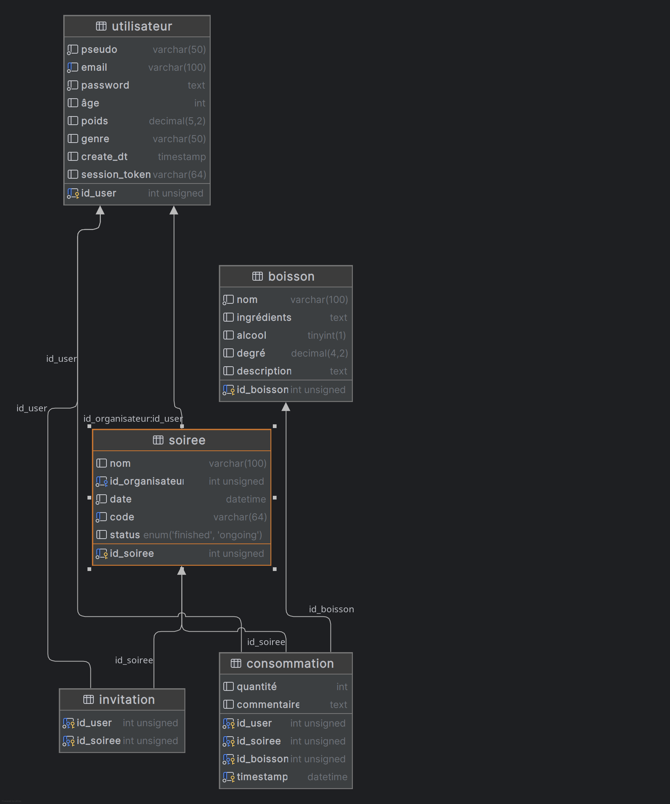

Ce document présente le projet Fesoif, réalisé dans le cadre du module Archi. logicielle Web. Vous y trouverez les schémas de
données, l’architecture applicative, les routes principales et les fonctionnalités proposées aux utilisateurs.

# **Équipe : Les Mixologistes**

- Baud Quentin (chef d'équipe)
- Martin Iwen
- Cuvillon Arthur

lien
github : <a href="https://github.com/aserlite/archi_log_projet.git">https://github.com/aserlite/archi_log_projet.git</a>

---

# Présentation du projet

Ce projet est une application web sociale permettant de créer et de suivre des soirées entre amis.  
Chaque utilisateur peut organiser une soirée, inviter ses amis, et chacun peut ajouter des verres depuis une base de
données.  
L’application calcule le taux d’alcoolémie de chaque participant en temps réel.  
Chaque utilisateur a accès à différentes statistiques : le nombre total de soirées, le nombre de verres consommés, et un
classement des boissons les plus consommées.  
L’objectif est de permettre un suivi ludique, informatif et communautaire.

---

# MCD


---

# MLD


*Les entités précédées d’un # désignent des clés étrangères. Celles soulignées désignent une clé primaire.*

---

# Schéma de la base de données




---

# Gestion des éléments

On permet à l'utilisateur d'agir sur plusieurs éléments du système. Il peut utiliser les systèmes CRUD (Create, Read,
Update et Delete) sur les entités principales suivantes :

### Utilisateurs

- **Ajout :** Un utilisateur peut s’inscrire via un formulaire.
- **Modification :** Un utilisateur peut modifier ses informations personnelles, sauf son email (mot de passe, nom,
  etc.).
- **Consultation :** Fiche utilisateur avec toutes ses informations.

### Soirées

- **Ajout :** Un utilisateur peut créer une soirée et choisir son nom.
- **Suppression :** L'utilisateur peut mettre fin à la soirée et la supprimer par la suite.
- **Consultation :** L'utilisateur peut consulter les données de la soirée et la partager avec ses amis.

### Boissons

- **Ajout :** Un utilisateur peut enregistrer les boissons qu’il prend pendant la soirée.
- **Modification :** L'utilisateur peut ajouter une boisson qui n’est pas dans la base de données. Il peut également
  ajouter un commentaire et une note à la boisson.
- **Suppression :** L'utilisateur peut supprimer une boisson qu’il a enregistrée.
- **Consultation :** Historique des boissons consommées sur la page de la soirée.

---

# Réalisation d'une association

Dans notre application, les **boissons** peuvent être associées à une ou plusieurs **soirées**, et une **soirée** peut
regrouper plusieurs **boissons**.  
Cette association est indirectement représentée via les consommations enregistrées lors d'une soirée.

Lorsqu’un utilisateur enregistre une consommation, il associe une boisson à une soirée.  
Cela crée une relation entre la soirée et la boisson à travers la table `consommation`.

De la même manière, nous avons une association plusieurs-à-plusieurs entre les tables `soirée` et `utilisateur` :

- Chaque utilisateur peut être invité à plusieurs soirées.
- Chaque soirée peut avoir plusieurs utilisateurs invités.

Cette relation est gérée via la table `invitation`.

---

# Architecture du projet

Le projet est structuré de manière modulaire pour faciliter la maintenance et l'évolution.

## Structure du projet

```
├── app_instance.py
├── db.py
├── Makefile
├── Readme.md
├── requirements.txt
├── routes.py
├── server.py
├── .env.example
├── .env
├── controllers
│   ├── consumption.py
│   ├── drink.py
│   ├── invitation.py
│   ├── party.py
│   ├── user.py
│   └── utils.py
├── models
│   ├── consumption.py
│   ├── drink.py
│   ├── __init__.py
│   ├── invitation.py
│   ├── party.py
│   └── user.py
├── static
│   ├── images
│   │   └── citations
│   ├── scripts
│   │   └── party_view.js
│   └── styles
│       ├── style_base.css
│       ├── style.css
│       ├── style_drink_single.css
│       ├── style_login.css
│       ├── style_party_view.css
│       └── style_register.css
└──  templates
    ├── base.html
    ├── drinks
    │   ├── add.html
    │   ├── drinks.html
    │   └── single.html
    ├── index.html
    ├── party
    │   ├── create.html
    │   └── view.html
    └── user
        ├── login.html
        ├── profile.html
        ├── register.html
        └── stats.html
```

---

# Découpage des routes

- `/` : Accueil – présentation rapide, accès aux soirées en cours ou passées, accès aux statistiques, etc.
- `/drinks` : Consultation des boissons de la BDD.
- `/drinks/create` (GET) : Formulaire d’ajout de boisson.
- `/drinks/create` (POST) : Création d’une boisson.
- `/drinks/<id>` : Détail d’une boisson.
- `/drinks/search` : Recherche de boissons.
- `/register` (GET, POST) : Inscription utilisateur.
- `/login` (GET, POST) : Connexion utilisateur.
- `/logout` : Déconnexion.
- `/profile` : Profil utilisateur.
- `/profile/edit` (POST) : Modification du profil.
- `/create_party` (GET, POST) : Création d’une nouvelle soirée.
- `/party/<id>` : Détails de la soirée (participants, verres consommés, taux d’alcoolémie…).
- `/current_party` : Soirée en cours.
- `/close_party/<id>` (POST) : Clôturer une soirée.
- `/party/join` (GET, POST) : Rejoindre une soirée via code.
- `/party/leave` (POST) : Quitter une soirée.
- `/party/add_conso` (GET, POST) : Ajouter une consommation à une soirée.
- `/party/write_taux` (GET) : Récupérer le taux d’alcoolémie.
- `/party/<id>/stats` (GET) : Statistiques d’une soirée.
- `/stats` : Statistiques globales.
- `/api/participants/<id>` : Liste des participants d’une soirée.
- `/party/<id>/history` : Historique des consommations d’une soirée.
- `/party/delete_conso` (POST) : Supprimer une consommation de l’historique.

---

# Améliorations futures

- Ajouter un système de notifications pour les invitations et rappels de soirées.
- Intégrer un système de géolocalisation pour trouver des soirées à proximité.
- Permettre aux utilisateurs de noter et commenter les soirées.
- Ajouter une fonctionnalité de chat en direct pendant les soirées.
- Ajouter des images lors de la consommation d'une boisson.
- Ajouter une fonctionnalité de partage de soirées sur les réseaux sociaux.
- Intégrer un système de gestion des amis pour faciliter les invitations.
- Intégrer un système de calendrier pour planifier les soirées.
- Intégrer un système de badges et récompenses pour les utilisateurs actifs.
- Intégrer un système de gestion des allergies et préférences alimentaires.
---

# Makefile

L’utilisation d’un Makefile permet de simplifier et d’automatiser les tâches courantes du projet.  
Grâce à des commandes courtes, il évite d’avoir à retenir ou répéter des instructions complexes pour installer les
dépendances, configurer l’environnement ou lancer l’application.  
Cela garantit aussi que tous les membres de l’équipe utilisent les mêmes procédures, réduisant les risques d’erreurs de
configuration.

## Commandes Makefile

```bash
make init
```

- Crée un environnement virtuel Python (venv)
- Met à jour pip
- Installe les dépendances listées dans requirements.txt
- Copie le fichier .env.example en .env si besoin

```bash
make start
```

- Crée l’environnement virtuel si nécessaire
- Installe les dépendances si besoin
- Lance le serveur Flask (server.py)

```bash
make clean
```

- Supprime l’environnement virtuel, les fichiers compilés et temporaires pour repartir sur une base propre.
