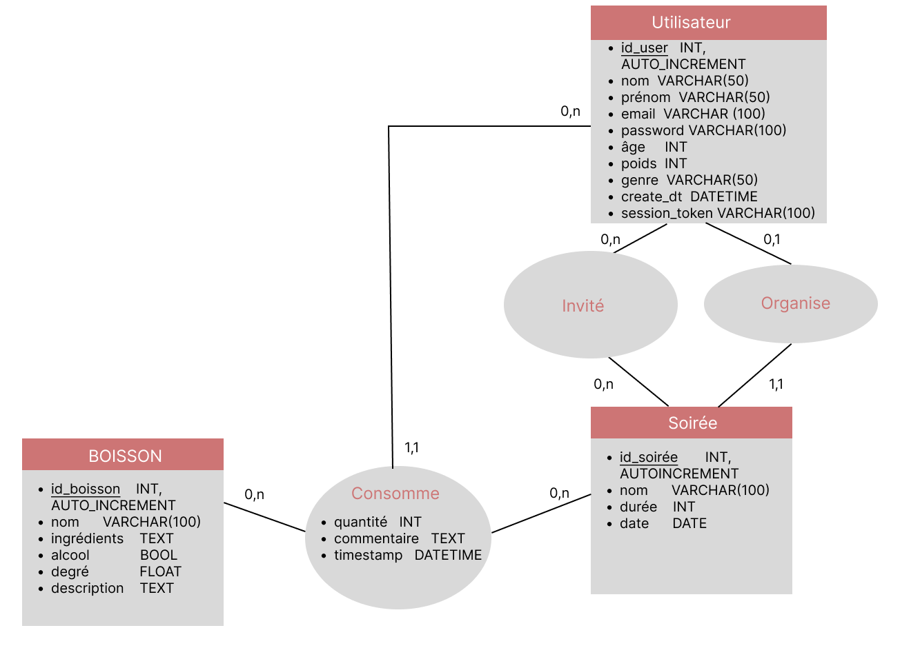
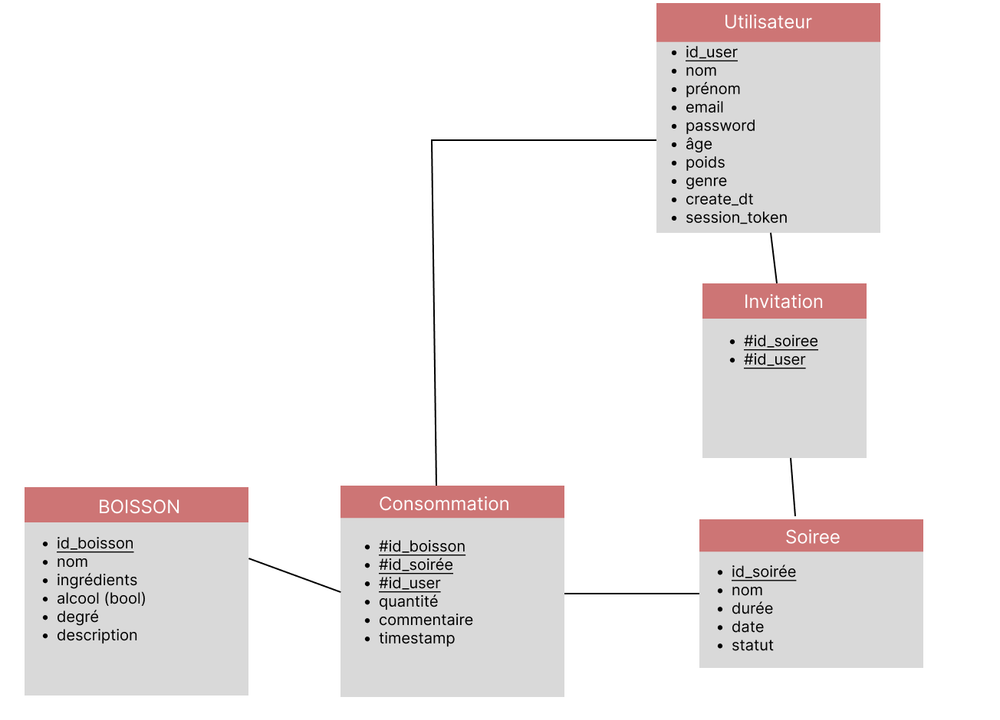

# **Équipe : Les Mixologistes**

- Baud Quentin (chef d'équipe)  
- Martin Iwen  
- Cuvillon Arthur

lien github : <a href="https://github.com/aserlite/archi_log_projet.git">https://github.com/aserlite/archi_log_projet.git</a>

---

# Présentation du projet

Ce projet est une application web sociale permettant de créer et de suivre des soirées entre amis.  
Chaque utilisateur peut organiser une soirée, inviter ses amis, et chacun peut ajouter des verres depuis une base de données.  
L’application calcule le taux d’alcoolémie de chaque participant en temps réel.  
Chaque utilisateur a accès à différentes statistiques : le nombre total de soirées, le nombre de verres consommés, et un classement des boissons les plus consommées.  
L’objectif est de permettre un suivi ludique, informatif et communautaire.

---

# MCD



---

# MLD



*Les entités précédées d’un # désignent des clés étrangères. Celles soulignées désignent une clé primaire.*

---

# Gestion des éléments

On permet à l'utilisateur d'agir sur plusieurs éléments du système. Il peut utiliser les systèmes CRUD (Create, Read, Update et Delete) sur les entités principales suivantes :

### Utilisateurs
- **Ajout :** Un utilisateur peut s’inscrire via un formulaire.
- **Modification :** Un utilisateur peut modifier ses informations personnelles, sauf son email (mot de passe, nom, etc.).
- **Consultation :** Fiche utilisateur avec toutes ses informations.

### Soirées
- **Ajout :** Un utilisateur peut créer une soirée et choisir son nom.
- **Suppression :** L'utilisateur peut mettre fin à la soirée et la supprimer par la suite.
- **Consultation :** L'utilisateur peut consulter les données de la soirée et la partager avec ses amis.

### Boissons
- **Ajout :** Un utilisateur peut enregistrer les boissons qu’il prend pendant la soirée.
- **Modification :** L'utilisateur peut ajouter une boisson qui n’est pas dans la base de données. Il peut également ajouter un commentaire et une note à la boisson.
- **Suppression :** L'utilisateur peut supprimer une boisson qu’il a enregistrée.
- **Consultation :** Historique des boissons consommées sur la page de la soirée.

---

# Réalisation d'une association

Dans notre application, les **boissons** peuvent être associées à une ou plusieurs **soirées**, et une **soirée** peut regrouper plusieurs **boissons**.  
Cette association est indirectement représentée via les consommations enregistrées lors d'une soirée.

Lorsqu’un utilisateur enregistre une consommation, il associe une boisson à une soirée.  
Cela crée une relation entre la soirée et la boisson à travers la table `consommation`.

De la même manière, nous avons une association plusieurs-à-plusieurs entre les tables `soirée` et `utilisateur` :

- Chaque utilisateur peut être invité à plusieurs soirées.
- Chaque soirée peut avoir plusieurs utilisateurs invités.

Cette relation est gérée via la table `invitation`.

---

# Découpage des routes

- `/` : Accueil – présentation rapide, accès aux soirées en cours ou passées, accès aux statistiques, etc.
- `/login` : Connexion utilisateur.
- `/register` : Inscription utilisateur.
- `/logout` : Déconnexion.
- `/party/create` : Création d’une nouvelle soirée.
- `/party/id` : Détails de la soirée (participants, verres consommés, taux d’alcoolémie en temps réel…).
- `/party/id/stats` : Statistiques de la soirée (verres, taux, classement…).
- `/profile/id` : Profil utilisateur (historique des soirées, statistiques personnelles).
- `/stats/global` : Statistiques globales (nombre de soirées, verres, top 3 des boissons).
- `/drinks` : Consultation des boissons de la BDD.
- `/drinks/add` : Ajout d’une boisson à la BDD.
- `/drinks/top` : Classement des boissons les plus consommées.

---

# Makefile

L’utilisation d’un Makefile permet de simplifier et d’automatiser les tâches courantes du projet.  
Grâce à des commandes courtes, il évite d’avoir à retenir ou répéter des instructions complexes pour installer les dépendances, configurer l’environnement ou lancer l’application.  
Cela garantit aussi que tous les membres de l’équipe utilisent les mêmes procédures, réduisant les risques d’erreurs de configuration.

## Commandes Makefile

```bash
make init
```
- Crée un environnement virtuel Python (venv)
- Met à jour pip
- Installe les dépendances listées dans requirements.txt
- Copie le fichier .env.example en .env si besoin

```bash
make start
```
- Crée l’environnement virtuel si nécessaire
- Installe les dépendances si besoin
- Lance le serveur Flask (server.py)

```bash
make clean
```
- Supprime l’environnement virtuel, les fichiers compilés et temporaires pour repartir sur une base propre.
